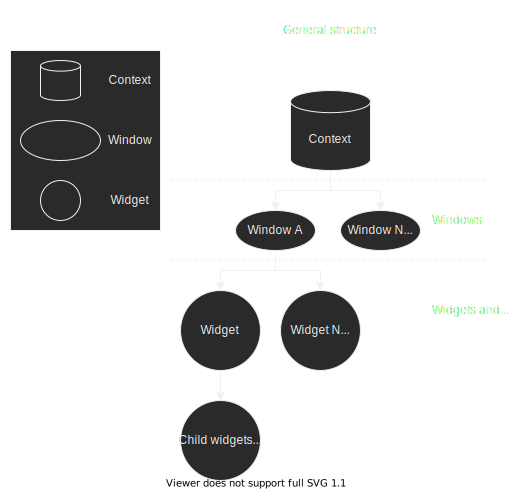
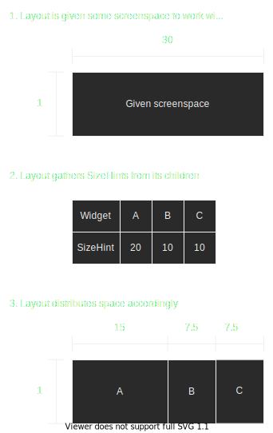

# Didgy's frustrating GUI adventures


## Introduction

This project started when I encountered a problem when working on my other project, DEngine. DEngine is a lightweight game engine oriented towards mobile 2D games. A main component of this engine is to have a level editor you could run directly on your tablet, do your level design, and playtest your level instantly from your tablet device. This level editor also had to work on Windows and Linux. With this functionality in mind I started testing several GUI libraries and frameworks, but these existing solutions all came short for exactly what I had in mind. After trying out libraries for over a month, I decided to roll my own solution.

Before I go on any further, I want to clarify that for the vast majority of hobby developers like myself, rolling your own GUI solution is **not** worth the effort and I do **not** recommend you do so.

This GUI project and DEngine is not a commercial product and is only developed as a learning experience for myself. Since this is not a framework/library but rather a set of tools embedded into the DEngine project, I will sometimes refer to the GUI code as a "GUI toolkit" or "GUI solution".

The following design presented is still very much a work in progress, and many aspects are still up for debate.

This blog post serves as an exercise for writing and an overview of the design I have made. It also serves as a way for future potential employers to have a better overview of my skillset and how I work.


## Example of the GUI


https://user-images.githubusercontent.com/25203601/135811833-9e5433c1-609c-44c4-9626-af4ea9e809c0.mp4


## Source code

The source code is currently embedded into my DEngine project, of which the repo can be found here https://github.com/Didgy74/DEngine. The GUI toolkit code can be found in the subfolders `include/DEngine/Gui` and `src/DEngine/Gui` or by clicking these links 

[https://github.com/Didgy74/DEngine/tree/master/include/DEngine/Gui](https://github.com/Didgy74/DEngine/tree/master/any/include/DEngine/Gui)
[https://github.com/Didgy74/DEngine/tree/master/src/DEngine/Gui](https://github.com/Didgy74/DEngine/tree/master/any/src/DEngine/Gui)


## Requirements for the solution

During my time trying out other solutions, I built myself a very specific idea of what requirements I wanted the solution to fulfill. I compiled a list of the following:

- Tight mobile/touch integration but with support for desktop
	- Support for on-screen keyboard supplied by the OS as well as auto-suggestions
	- Support for rendering around screen decorations from OS, such as navigation and status bar on Android
- Does GUI logic and *only* GUI logic
	- It does no windowing interfacing or input handling
	- It does no actual rendering, only produces data that can be translated to rendering
- Does not hijack execution flow
- Performant
	- Runs effortlessly on mid-end Android tablets.
	- Is "hyper-responsive"
- No global state
- Respect order of events
- Automatic resizing of widgets

Things I did not want to focus on:
- Ease of use
- Theming (Possibly in the future)
- Animations (Possibly in the future)
	
	
## Initial architecture decision

My first decision was choosing between immediate-mode and retained-mode. I was not confident I could write immediate mode in such a way that it would be power-efficient and perfectly respect order of events, while also providing great support for on-screen keyboards. I ended up choosing a retained-mode, my goal was to describe the GUI using a structure of data and calling appropriate callbacks when events called for it.

Before I started landing on design choices, I tried looking into how retained-mode GUIs are designed. I came across a few, such as model-view-controller but ultimately I did not understand how they worked. I ended up with a design that models the data in a similar fashion to GTK and Qt, as that is the one I was personally most familiar with and made the most sense. This sort of retained GUI is often referred to as "Smart widget" style.

Before I could start getting into details on how I would model the data, I needed to figure out how I would iterate over this data in terms of handling events. In my architecture, an event has a very simple definition: Event is something that happened. Examples of events are window-resize, cursor move and cursor-click and touch-press. The idea was that an event move from the root of the data-structure, and keep dispatching it to whatever widgets that need it.

The data structure I ended up with is essentially the standard N-tree. The root is a struct I've dubbed the `Context`. This is essentially a container for the top-level windows, and it accepts the state that would otherwise exist as global state in other libraries. This includes current input-state such as mouse-position, and also manages things like text font-loading and the `InputConnection`. 

Some keywords to mention
- **Window** - maps 1:1 to an OS window
- **Layout** - A widget whose purpose is to be a container for child widgets, and propagates events to them.
- **SizeHint** - A struct that lets a widget send a hint to it's parent container to describe how it wants to be sized. Widgets generally have no way to guarantee size constraints, but they can use hints to incentivize the owning layout(s).

The overall structure can be grossly generalized as such:



Example of how the data-structure can be translated into an actual GUI


## Automatic resizing

A deficiency I have seen in several applications is the inability to scale correctly to high pixel density-displays, or very big/small displays. The goal I have in mind here is to allow the GUI to scale itself up and down to any display size or to any pixel-density, by defining behavior rules in each widget.

All applications have a minimum size they need in order to function at all. However, an application's GUI should, in theory, be able to scale upwards infinitely. When you have a single widget, you can set it to the window's extents and have it scale infinitely right away. The problem becomes more complex when you have multiple widgets that need to share screenspace.

To figure out the exact problem and build a solution, I had to work iteratively. Let me walk you through the steps I have gone through so far.

Assume we have a layout L. It has three widgets A, B, C and L's job is to place these widgets next to each other horizontally in a given screenspace, dividing the space equally. Lets assume L is given a screenspace of dimensions 1x30 units.


This results in a very simple design that scales to literally any display. The formula is simply: 

```
childWidth = inputWidth / childCount
```

However, this does not give you any flexibility in how the GUI will scale. For example, you don't always want to scale something beyond a specific size, and you might have some requirements as to how small the widget can be for it to be functional at all.

So the next problem to solve is to give a widget more control over how it should be sized. There's one fundamental idea I had to learn when working on this. The only absolute screenspace is the window itself. The size a widget is eventually given is entirely dependant on the window and layouts it exists within. Therefore a widget can never demand a size and expect it to be given that size. At best, the widget can only ever give soft hints as to how a parent layout should distribute and prioritize screenspace between children. Enter the SizeHint structure.

A SizeHint is a simple structure that a Widget needs to produce. It contains data that hints on how an owning Layout is supposed to assign it screenspace. In my current design, the actual contents of this structure is a bit blurry and tends to change. This structure may include desired size, minimum size, maximum size, positional alignment. Now, the way this is meant to be used is that any time the layout needs to rebuild, the owning layout will query it's children for their SizeHints. Based on those hints, it will make educated guesses on how to distribute the screenspace among it's children.

Assume we have a similar layout L to the one above. L has 3 children; A, B, C. However, this time each children can be queried for a SizeHint. For simplicity in this example, let's define a SizeHint as a value that says how wide the widget wishes to be. The process will be something like the following:



The formula for this layout distribution is
```
childWidth = sizeHint * sum(childrenSizeHints) / inputWidth
```
While the details of may change over time as my design matures, I can see one general pattern emerging. When building the actual size-distribution, the process in done in two stages: The *hint-gather stage* and the *allocation stage*. In essence; a Layout will gather it's children's SizeHints, and based on values such as the min-max and sum of the hints, it will enter the allocation where runs it's algorithm to distribute the actual screenspace. 


## Resizing continued: Dynamic GUIs

The next problem to solve was how and when the GUI should reflect a change in how size is distributed. More specifically, I need to take into account that the GUI data-structure can be modified while it's dispatching events. Let me walk you through an example of the problem.

Assume we have a layout L with 3 children, A, B and C. Layout L stacks it's children horizontally, and distributes the space equally always. Our first example shows how we expect the GUI to behave outside the context of an event being dispatched. A typical resize in the event of a widget being removed would be fairly simple, like so:


This is pretty straightforward and easy to expect. The problem arises when the GUI structure is currently is dispatching an event. When this type of layout dispatches an event, it will have to sequentially propagate it to it's children. The problem is that when a child handles the event, it might destroy itself or another child within that same layout. This enforces a screenspace redistribution, and when it's time for the *next* child to handle the event, it will be operating with inconsistent screenspace values. This essentially turns into a type of undefined behavior. Let me explain such a scenario with the following diagram:


The problem here is that B accepts the event and handles it as it should. However, since the size-configuration of the layout is updated immediately, then C will have it's position and size modified. Therefore C will now also accept the event and handle it, from C's point of view it functions correctly. This is a type of behavior we *don't* want, as it means the behavior of the GUI becomes unpredictable from a programming point of view.

The solution I came up with for this problem is the following. A Layout should not update the screenspace-distributions of it's children until *all* the children are done handling the event.


In terms of implementing layouts that dispatch events, implementing the following rule is highly encouraged to avoid unexpected behavior. That is to say, you can freely add and remove widgets to your layout and expect them to be available from the layout immediately, but from a screenspace point-of-view the Layout pretends as if nothing has changed until all children are done handling the current event being processed.


## Avoiding direct window and input management

I mentioned earlier that I did not choose to use 3rd party libraries such as Dear ImGui, but I still found parts of these libraries that I did like. I especially liked the approach to windowing and rendering, but for now I want to talk about the windowing and input part.

One of the things I disliked with some of the GUI frameworks/libraries I tried is the fact that they enforce you to run their windowing and input solution. This makes them fundamentally less modular. I'm sure they have their reasons, to have a tight OS integration you need a fairly complicated connection between the windowing and GUI, and have a user implement that connection themselves can be a complicated endeavor. It makes the distance of going from no GUI to functional GUI longer and is less user-friendly overall. However, that's not a consideration in my project. My goal is to decouple windowing and GUI logic completely even if it means complicating the integration process.

Fundamentally, the GUI logic only really cares about the hard data. Where is the window, how big is it, where is our cursor and si in. I decided early on that the easiest way for this was to represent a window as an opaque handle in GUI code. This means that the GUI only ever cares about the handle and the data associated with it. The external code, feeding window updates into the GUI, can pass this opaque handle along to reference the correct window. Other than that we also have a few callbacks that lets the GUI generate new windows when it wants to, but that's not the important right now.

Updating the data for a window is as simple as passing in a struct with the window handle and the new data. In pseudo-code:
```cpp
enum class WindowID; // Opaque handle/integer

struct WindowResizeEvent
{
	WindowID windowId;
	int width;
	int height;
};

class Context
{
	void PushEvent(WindowMoveEvent);
	
	// ... Lots of other methods ...
}:

// Usage

Context myContext = // Initialize...
WindowID windowA = // Initialize...

// We detected our window was resized, now we push the update
WindowResizeEvent newEvent;
newEvent.windowId = windowA;
newEvent.width = newWidth;
newEvent.height = newHeight;
myContext.PushEvent(newEvent);
```
During the `myContext.PushEvent(newEvent)` call, the `Context` will update the size of the window in question and dispatch the event to widgets, which will in turn call any callbacks set by the user.

The advantage to doing things this way is that the windowing interaction is now completely data-driven. There are no special hooks into platform specific APIs or anything of the sort. You can also build your own queue of events and batch their submission to the `Context`. Additionally, you can even create virtual windows! Windows that only exist in memory and has no actual on-screen counterpart. Though I am early into the development phase here, I am convinced that by keeping everything data-driven and with no platform-specific APIs in play, I can keep this code both modular and cross-platform moving forward.

This concept is directly applied to input also, such as cursor input and touch input. Gesture input has not yet been designed.


## Decoupling GUI from rendering

This is yet another part of Dear ImGui that I did like. The idea is to avoid having the GUI `Context` own a OpenGL context, Vulkan instance or the DirectX equivalent. I also want to avoid having the GUI toolkit making any specific calls into any of these APIs. If I keep everything in user-space without any platform-specific APIs, supporting a new platform is a matter of implementing a new backend, (hopefully) without modifying any of the actual GUI code. In the spirit of making things modular and simplifying the execution flow, widgets do not render anything when handling events, they simply update their state so they can push render-commands later in a "rendering stage".

Fundamentally, I can think of two solutions:
 - A polymorphic or callback-based interface that each widget pushes commands to
 - Having the `Context` build a struct filled with i.e vectors that contain data a renderer can translate into draw-calls

Either of these is only executed when the user requests it from the `Context`. In my current implementation I've opted for the second option, but in the future I believe I will change to the first since it allows the second to be implemented on top of the first. (Jeez, this was a terrible sentence, fix it pl0x)

This approach puts the actual rendering into the user's hands. Alternatively, if the GUI toolkit becomes a standalone library in the future, it can provide an example or reference implementation so the user can get started building a simple GUI app right away.

In any case a standalone GUI library would have to at the very least provide reference shader implementations, so that any renderer can implement the visuals correctly by translating the shaders to whatever shading language is being used.

It should be noted: Currently in the source code, the GUI toolkit just outputs data that the rendering module can read directly. This is a benefit from the GUI toolkit being directly embedded in the project, but in a standalone library this would be using it's own type-definitions and pseudo-code for reference shaders.


## Transparent execution flow

With these designs in mind, it's very easy to control when the GUI does anything. By combining the data-driven event design and the rendering design, the execution flow of the entire toolkit comes down to

For every event:
1. Push event to `Context`
2. The structure calls the appropriate callbacks
3. The structure updates it's internal state

When done, you can then *optionally*
 - Request rendering data from the `Context`

This puts the flow of the app very much in the hands of the user. There is no hidden rendering thread. There is no uncertainty of what is thread-safe or not. There is no uncertainty of when the state of the GUI is changed. There is no uncertainty in what callbacks you can expect to be called.

... Talk about how this idea is transferred into how updates are carried out in code, i.e when modifiying a member of a widget/layout.
