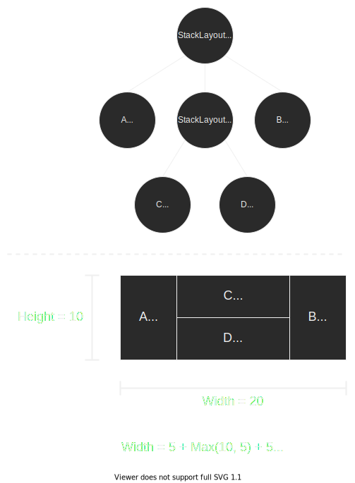

# Introduction

In this blog post I want to talk about a concept in my GUI architecture essential to reactive layouting. More specifically, I want to talk about how my code currently fails to implement the concept correctly. Afterwards, I'll talk about how I can solve this, and perhaps even speed up the code architecure at the same time. 

But first, here's some terminology to keep in mind while reading.

**Widget**

Essentially any GUI element that takes up some portion of the screen, and is able to accept some combination of events. Examples include buttons, text, images.

**Layout**

A specialized form of Widget that can hold nested Widgets, or "children". Primary purpose is placement and resizing children in relation to each other. It is also responsible for forwarding events to children. Examples include horizontal and vertical lists of widgets. There are some types that can be seen as partial Layout, partial Widget since they both manage children and handle events in their own right. An example of this includes ScrollArea, which displays a child inside a scrollable area while also managing interaction with the scrollbar.

**SizeHint**

A simple set of values that describe how a Widget wants to be sized in order to be displayed in the best way possible. Members may include minimum size, maximum size. ideal size and "expand as much as possible".

**Measure**

In this text I'll be using the word "Measure" in the context of GUI elements (Widget). This does not mean measuring any physical or digital size. It actually refers to querying how large a Widget desires to be. In terms of code, it means calling `.GetSizeHint(...)` on a Widget object and doing something with the value it returns.

**Rect**

Short for "Rectangle". It's really just a position and size. Most often associated with a Widget.

# The "Measure, then distribute" pattern

In my current GUI architecture, assigning screenspace to widgets follows a very distinct 2-step pattern. The reason this pattern is necessary has been described in one of my previous blog post, but the TL;DR is something like:
 
In a reactive layouting system, individual GUI elements must be resized in such a way that the collective of widgets fill in the given rectangle of pixels most optimally. Different GUI elements have different requirements for how they are optimally resized. In such a system, GUI elements can not have absolute control over their actual size, and can only give hints on how they should be sized. This means each individual GUI elements actual size is highly dependent on the SizeHints of the entire GUI structure.

With that explained, the 2-step pattern is as follows:

1. Gather all SizeHints for all relevant elements in the GUI hierarchy
2. Given the rectangle of pixels the GUI needs to reside within, distribute sub-rectangles to widgets by taking their SizeHint into account

Or if you want to make it even more simple: "Measure, then distribute." This concept has been sound for my purposes so far.
There's only one detail about this pattern I want to explain before I show the problem in my implementation. This detail applies particularly to Layout-types of GUI elements.

Many Layout-types use a size-hint that is a sum of their children. That is to say, they want to give all their children exactly the size they want in an ideal scenario. Let's take the basic horizontal StackLayout type. A StackLayout has a list of children that it wants to fit into a larger rectangle, and this rectangle acts a sum of the childrens desired rectangles. In the case of the of a horizontal StackLayout, the width of the StackLayout is defined as the sum of the childrens widths. The height is defined by the maximum height of the children. In the case of a *vertical* StackLayout, the rules of width and height are switched. 

Keep in mind that Layouts can contain nested Layouts. Such as a horizontal StackLayout containing a nested vertical StackLayout. Below I have a diagram depicting this.

In this diagram, the SizeHint 

Note: While the dimensions are correct, the geometry is approximated only.

# The problem in my code

In my current implementation, I measure the hierarchy but then I do the screenspace distribution in the same step as event dispatching. The way I do all these things is by recursively iterating through the hierarchy. The process goes something like listed below. In the following example we will use the pattern in the context of an event dispatch, as this is the only context so far of which I've had any use. You can consider rendering just a slightly specialized form of event. 

Assume we have a Widget Root of type StackLayout and this holds two children, A and B. Here is what our event dispatch looks like.

1. Measure Root¹
2. Distribute screenspace to Root¹
3. Dispatch event to Root
4. Measure A
5. Measure B
6. Distribute screenspace to A
7. Dispatch event to A
8. Distribute screenspace to B
9. Dispatch event to B

This is already a process with many steps, and the more nested children you have (and non-trivial apps will have quite a few) the worse it gets. It can theoretically hold infinite amount of nested children.

Now here is where the problem begins. Recall that Root is a StackLayout, and to measure a StackLayout we need to measure its children. In my implementation *measurements are not cached*. That is to say, any measurement I make in my code will only last for the duration of the function call making the measurement. In my implementation, the steps will look like the following:

1. Measure A
2. Measure B
3. Measure Root¹ (Sum of A and B)
4. Distribute screenspace to Root¹
5. Dispatch event to Root
6. Measure A - Duplicate!
7. Measure B - Duplicate!
8. Distribute screenspace to A
9. Dispatch event to A
10. Distribute screenspace to B
11. Dispatch event to B

The problem here is that A and B are measured twice, or rather more than once. The problem only gets worse from here. Suppose A is also a StackLayout with its own two children, C and D. In this scenario, C and D will have to be measured three times in order to dispatch a single event. Firstly and most importantly: This is not correct bevavior, as we don't want to give any Widgets the opportunity to change their mind in the midst of distribution, as our screenspace distribution only makes sense when they don't change their size requirements. Another problem is that this can actually affect performance for some Widgets, particularly the ones where generating the SizeHint is a non-trivial operation. Take a Widget that displays rich-text as an example, it can contain a lot of text, and without any caching mechanism it will have to iterate over each glyph to find the total bounding box of the text.

The reason for this is that my implementation only measures and forgets. Recursively measuring children is necessary for certain types, what I essentially need is a mechanism that remembers which Widgets have been measured and reuses those measurements.

Footnote:

1. In many scenarios, we will just assign the entirety of our window to the root widget. So this step can often be skipped.

# But why not just store the size along with the Widget itself?

*"Surely, it must be easier for the Widget to always know how large it is? No more measurements, and now the user can do `.GetRect()` to read how large the widget is at any time. All other GUI solutions let you do this."*

To answer, I will explain why having direct access to a widgets size at any given point makes no sense (to me). A Widget can never actually decide what Rect it has, that would break the reactive layouting of the rest of the GUI. The Rect of a Widget only makes sense in the context of all other Widgets in the GUI hierarchy. If one GUI Widget has a state change that affects its SizeHint, that could in some cases affect how space is distributed to a Widget on the opposite end of the GUI. This means that the size member you just received from `.GetRect()` is no longer up to date and is not a correct value. This is caused by a *completely different Widget* changing its state. 

At best, you'd be able to know the most recently known size. Which is in all likelihood the one size given to it at the last event dispatch.

The next question you might ask is *"Well, can't you iterate over the hierarchy and update the sizes every time a Widget has its SizeHint invalidated?"*. Technically, this is possible but it would go against some of my goals for the GUI project, in particular the goal "Does not hijack execution flow". If I did this, every time you modify a seemingly harmless part of the GUI, this would invoke a heavy procedure that goes on to touch as much as every Widget you have hooked up to your GUI. This would generally make your user-code less easy to read, because you're no longer able to tell what your modifications to a Widget might imply in terms of operations being performed.  

# Rough idea of the solution

In light of this I've chosen to go for an approach where I use a transient type of container. A "Tree of Rects" if you will. This container is built during the measuring-stage, it will hold the Rects of all relevant Widgets and it will be valid until the event-dispatching is over. Without fleshing out the details, the idea is that Widgets will be inserting their SizeHint into this structure, and then grabbing their size from the container during the event-dispatching. Optionally, it can also enable querying for the last known Rect of a Widget in between events in the GUI.

Conceptually, the process of performing an event dispatch would be done in three steps. Step one is gathering SizeHints for each widget. Afterwards, we'd walk the hierarchy again and assign the actual Rects to each widget we measured in the previous step. Finally, with our "Tree of Rects" finished we can now traverse the hierarchy again and dispatch the events. 

---

### A quick note about performance

So with that explained, some of you might now be wondering if traversing the entire hierarchy three times would not be performant enough. Bleh bleh something about flattening the tree in order of iteration...

---

There is also one functionality I want to experiment with for this container. The optional feature of storing some arbitrary data along with the Rect associated with a Widget. Something something related to text rendering in particular...